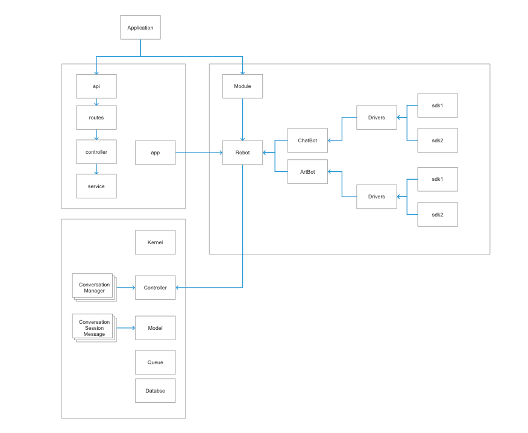

# RobotChat
主要是整合现在比较火的GPT和SD的AIGC模块，该项目现阶段是我们内部需要使用，所以属于快速迭代的阶段。

# ArtBot
基于StableDiffusion的接口对接应用

## 主要接口

* Text2Image：

这个接口适用于那些需要将文本描述转化为相应图像的场景。例如，用户输入了“一只橙色的猫在绿色的草地上玩耍”，这个接口就可以生成一张与描述匹配的图片。

暂时该接口是实时等待处理

* Image2Image：

此接口适用于需要将图像进行转换或修改的场景。例如，你可能希望把一张彩色照片变为黑白，或者增加一些艺术效果，如将一张普通照片转化为像梵高的星空那样的画作。

暂时该接口是实时等待处理

* ChatText2Image：

这个接口在多轮对话场景下将文本描述转换为图像可能会很有用。例如，你的聊天机器人在和用户交谈，用户首先说：“我想看一张海滩的照片”，然后又补充说：“在夕阳下”。你的机器人就可以生成一张夕阳下的海滩图片。

该接口是异步请求

* ChatImage2Image：

此接口用于在多轮对话场景中对图像进行转换或修改。例如，首先用户上传了一张猫的照片，然后他说：“能把这只猫变成蓝色吗？”你的机器人就可以生成一张蓝色猫的图片。

该接口是异步请求

# ChatBot
现在基于GPT的接口对接应用

## 主要接口
有几种主要的交互模式，包括 "Completions"、"Chat Completions" 和 "Stream Completions"。
* Completions：

最基础的使用模式，以单个提问或者语句为输入，生成一个连续的文本作为输出。模型并不保留之前的输入信息。每次输入都是新的，互不关联。

此模式通常适用于所有的自回归语言模型，因为它们的基本设计就是根据前文生成后续的内容。

* Chat Completions：

这种模式更适用于一对一或一对多的对话情况。输入是一个包含多个“角色”和各自“内容”的对话数组。这样可以模拟多轮对话，因为模型能在处理当前输入时，参考到过去的对话内容。

此模式主要适用于需要上下文理解的场景，其中包括聊天机器人、问答系统等。这种模式需要模型能够理解并记住前面的对话内容，因此适用于具有上下文理解能力的模型。

* Stream Completions：

这是一个实验性质的模式，它允许在请求之间保留模型的内部状态，以便进行长时间或多轮的交互。这意味着你可以将多个请求串联在一起，模型会记住之前的状态，并在之后的生成中考虑到。这种方式可以实现更长时间范围的上下文对话。

此模式需要模型具有记忆长期依赖的能力，能在一次会话的不同请求之间保持内部状态。这种功能可能需要特定的模型设计或者更复杂的系统设计来实现。

每种模式有其特定的应用场景，根据你的需要选择合适的模式。例如，如果你正在设计一个能进行多轮对话的聊天机器人，你可能会选择使用"Chat Completions"或"Stream Completions"。

## 模块架构设计

## 使用Gin的网络接口访问
可以作为一个独立的微服务，供其他项目调用，比如php，java等，通过http协议访问robot，请求作业。

## 直接通过Module引入Golang项目
可以直接引入到项目中使用，比如我们自己在做的PowerPrompt项目

## 支持队列消息调度

为了应付多用户访问并发需求，支持队列消息请求